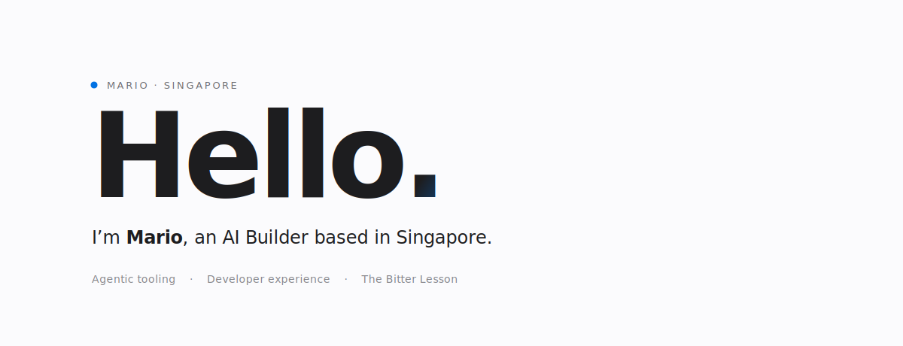

<!--
  README.md · 0xmariowu
  Designed in the spirit of Apple's product pages — simple, elegant, silky.
-->

<picture>
  <source media="(prefers-color-scheme: dark)" srcset="./assets/hero-dark.svg">
  
</picture>

---

 

  <em>"The biggest lesson that can be read from 70 years of AI research is that general methods that leverage computation are ultimately the most effective, and by a large margin."</em>

  — Rich Sutton, The Bitter Lesson

 

---

### Selected Work

#### [AgentLint](https://github.com/0xmariowu/AgentLint) &nbsp;`Shell · 22 ★`
The linter for your agent harness. Works with Claude Code, Codex, and Cursor.

#### [Autosearch](https://github.com/0xmariowu/Autosearch) &nbsp;`Python · 14 ★`
Open-source deep research for coding agents.

#### [VibeKit](https://github.com/0xmariowu/VibeKit) &nbsp;`Shell · 5 ★`
A senior team's engineering setup — CI, security, governance, agent docs — drop it into any repo, and your AI agent already knows how to work in it.

#### [Vibe Coding Spec](https://gist.github.com/0xmariowu/2c3e3ceaf9b79fe9b27df87441323ec3) &nbsp;`Gist`
Engineering spec written for AI to read. The handbook your agent wishes it had.

---

### Elsewhere

**X / Twitter** &nbsp;→&nbsp; [@0xMarioWu](https://x.com/0xMarioWu)  
**GitHub** &nbsp;→&nbsp; [0xmariowu](https://github.com/0xmariowu)  
**Location** &nbsp;·&nbsp; Singapore · UTC+08

 

Built with care · Last updated April 2026
